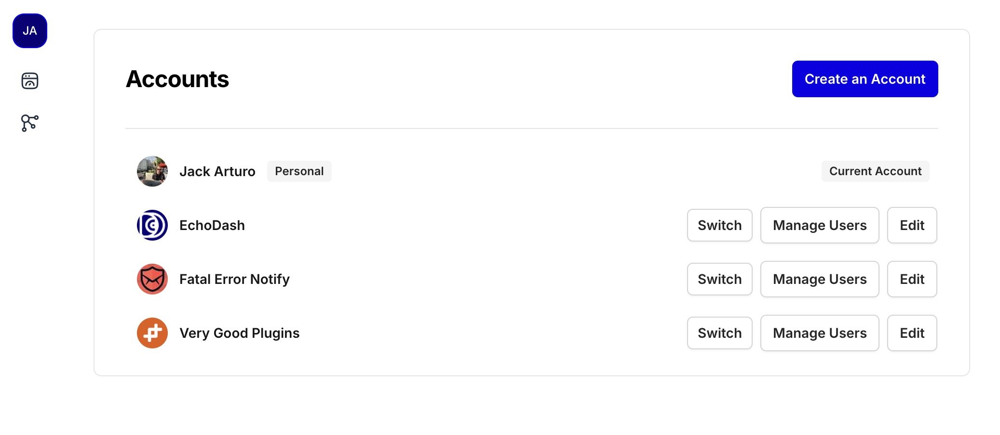

Today's EchoDash app update includes several new features and improvements:

### New

* Added a link to the [EchoDash WordPress plugin](https://wordpress.org/plugins/echodash/) to the Sources tab
* You are now required to confirm your account email address before you can create new endpoints

### Improvements

* The EchoDash app now handles the marketing double opt-in flow when creating a new account or joining the mailing list
* Improved [team account management](/docs/getting-started/team-accounts): buttons to manage team members and edit accounts are clearer in the app

<!-- truncate -->

### Fixes

* Fixed some broken redirects after saving a user profile or account