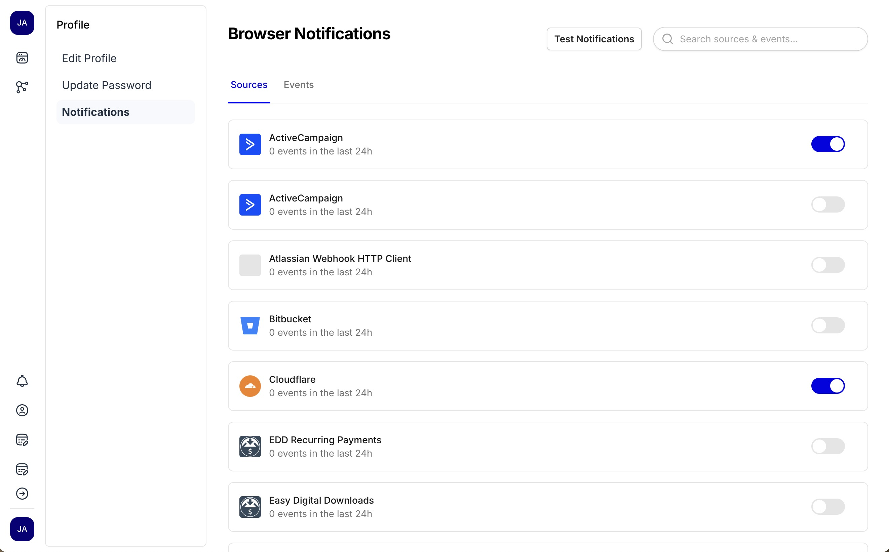
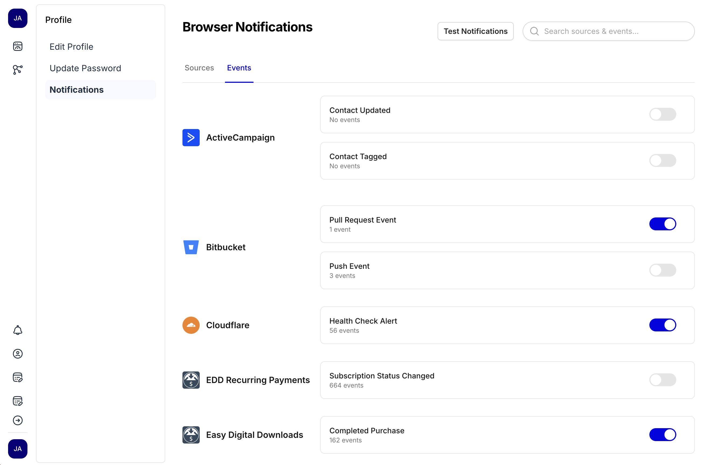

Today's EchoDash app update v1.2.0 introduces our first set of notification features to the app.

## How to use notifications

Head to your profile and click the "Notifications" tab. You can click the toggle next to any source to enable real-time browser notifications for that source.

Your browser will prompt you one time to allow notifications from EchoDash. Once enabled, desktop notifications will appear as long as the EchoDash tab is open in your browser.

## Notifications by event

<!-- truncate -->

You may not want to receieve every notification, so you can also choose to receive notifications for specific events. Click on the "Events" tab to select the events you want to receive notifications for.

