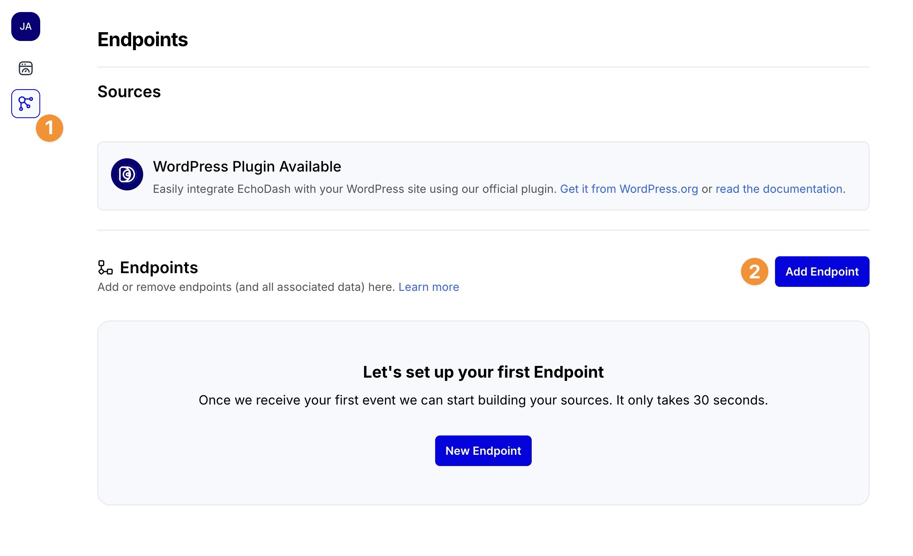
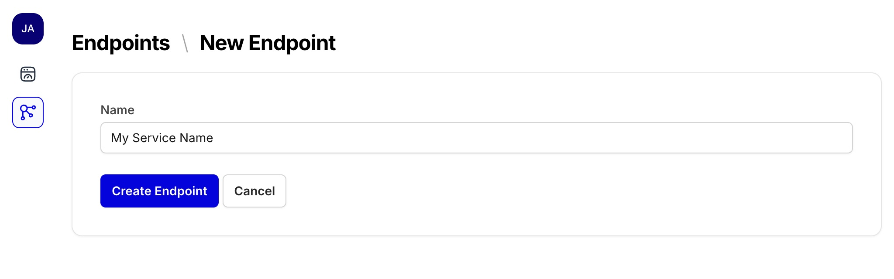
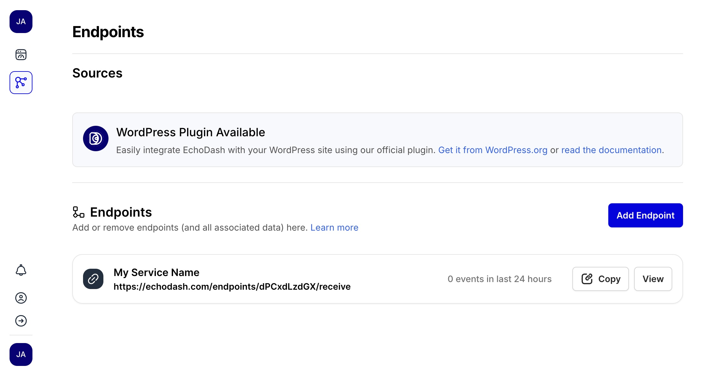
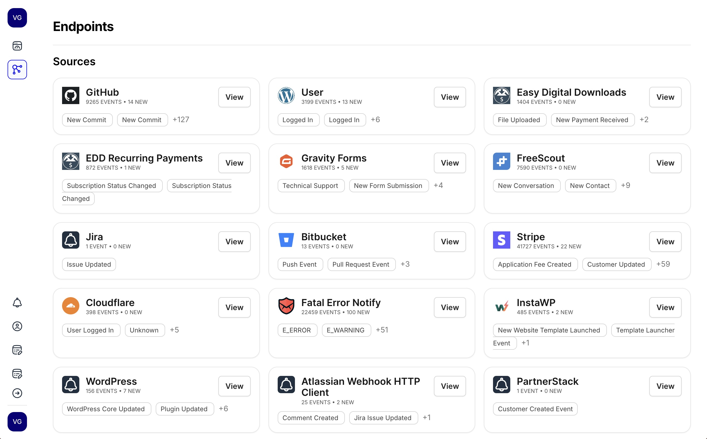

# Creating and Using Endpoints

In EchoDash, **endpoints** are the entry points for receiving webhooks and event data from your applications and external services. Each endpoint provides a unique URL that you can use to send data to EchoDash.

## Creating a New Endpoint

To create a new endpoint in EchoDash:

1. Log in to your EchoDash account
2. Navigate to the **Sources** panel in the sidebar



3. Click on **Add Endpoint** button
4. Enter a descriptive name for your endpoint (e.g., "Production API", "Stripe Webhooks", "WordPress Site")
5. Click **Create Endpoint**



Once created, you'll be taken to the endpoint details page where you can see your unique webhook URL. You can view your endpoints from the **Sources** panel.



## Endpoint URL Structure

Each endpoint has a unique URL in this format:

```
https://echodash.com/endpoints/YOUR_ENDPOINT_SLUG/receive
```

Where `YOUR_ENDPOINT_SLUG` is a unique identifier for your endpoint. This URL is what you'll configure in your applications or services to send webhook data to EchoDash.

## Sending Data to Your Endpoint

With your endpoint created, you can now configure your applications or services to send webhook data to it. EchoDash accepts any JSON or form-encoded data via POST requests.

EchoDash will automatically analyze your payload and extract the most relevant information to display in your event feed.

Data sent to your endpoints will be categorized into Sources, and can be viewed in the **Sources** panel.



### Testing Your Endpoint

You can test your endpoint by:

1. Configuring your application to send a webhook to your endpoint and wait for one to come in
2. Or, for testing purposes, sending a sample webhook using curl, Postman, or any API tool
3. Checking the **Events** feed in EchoDash to see the received data
4. Viewing the event details to ensure data is being extracted correctly

## Managing Endpoints

### Viewing Endpoint Details

To view details for an existing endpoint:

1. Navigate to the **Sources** panel
2. Click on the endpoint name in the list

This will show you:
- The endpoint's unique URL
- Recent events received by this endpoint
- Creation date and other metadata

### Renaming an Endpoint

To rename an endpoint:

1. Navigate to the endpoint details page
2. Click on the **Edit** button
3. Enter a new name
4. Click **Update Endpoint**

### Deleting an Endpoint

To delete an endpoint:

1. Navigate to the endpoint details page
2. Click on the **Edit** button
3. Click on the **Delete** button
4. Confirm the deletion

**Note:** Deleting an endpoint cannot be undone. Any applications or services sending webhooks to this endpoint will receive a 410 Gone status code after deletion. **All events received by this endpoint will be permanently deleted.**

## Next Steps

Now that you've created an endpoint, you can:

- Set up [browser notifications](/docs/notifications/browser-notifications) to get alerted when new events are received
- Configure [email digests](/docs/notifications/email-digests) to receive summaries of your webhook events 