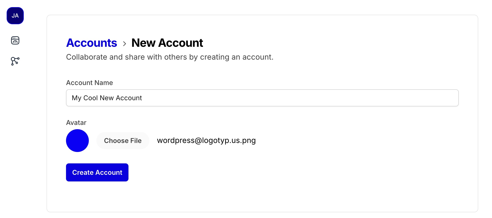
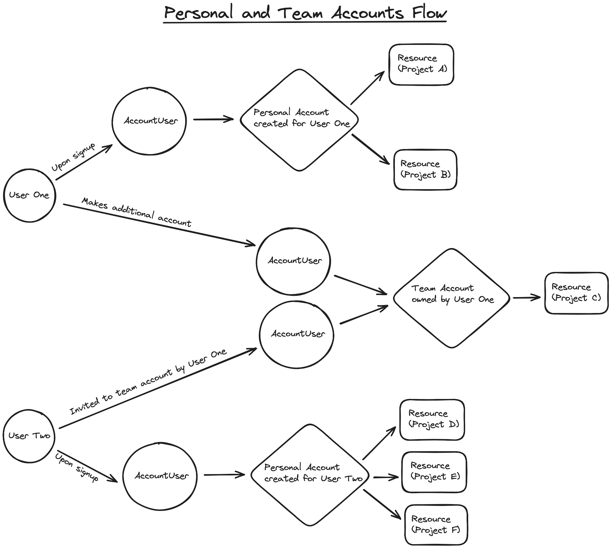

# Team Accounts

EchoDash offers powerful team collaboration features that allow you to share notifications and insights with your entire organization.

## Personal vs. Team Accounts

EchoDash supports both personal and team accounts (aka sub-accounts).

- **Personal Account**: Your personal account is the default account you create when you sign up for EchoDash. It will show all your notifications and insights from your personal account, as well as any team accounts you are a member of.
- **Team Account**: A team account is a shared account that allows you to collaborate with your team on notifications and insights. Endpoints and sources created in a team account will be visible to all team members. You can switch into a team account to only view events from that account.

Even if you aren't collaborating with outside users, team accounts are a great way to group events based on projects, departments, or different businesses, while still allowing you to view all events by switching into your personal account.

GitHub is an example of a similar flow that has both personal (solo) and team accounts. Many users of GitHub start off with a personal (solo) account and then later add new team account (GitHub calls these organization accounts) so they can add users and collaborate within that team account.

## Viewing and Switching Accounts

To view and switch between your personal and team accounts, click on your user profile icon in the top left corner and select the account you want to switch to.

## Creating a Team Account

To create a team account in EchoDash:

1. Log in to your EchoDash account
2. Click on your user profile icon in the top left corner
3. Click "Create An Account"
4. Enter the account name, and optionally upload a profile picture

## Managing Team Members

To manage team members, click Manage Users next to any account name.

### Adding a new user

Click "Invite A User" to add a new user to the account.

Enter the user's name and email address, and select their roles:

* **Admin**: Full access to all team settings and member management.
* **Member**: Can manage sources, endpoints, and notifications, but cannot invite new users or manage team settings.

Click "Send Invitation" to send an email to the user with a link to sign up for EchoDash.

You can also click "Copy Link" from the team management page to copy an invite link to share with the user.

### Removing a user

Click "Edit" next to any user and then click "Delete" to remove them from the account.

Note this will not delete the user's personal account, only their access to this account.

### Removing yourself from an account

To remove yourself from an account (as long as you are not the owner), click "Edit" next to your name in the account users list, and click "Delete".

This will remove you from the account, but you will still have a personal account. You will no longer see events from that account in your Personal account's dashboard and activity feeds.

### Transferring account ownership

To transfer the ownership of an account to another user, click "Edit" next to the account name and select an account user from the Transfer Ownership dropdown.

This will transfer ownership of the account to the selected user. You can then optionally remove yourself from the account.

## Personal and Team Accounts Flow

The diagram below shows the relationship between personal and team accounts.

