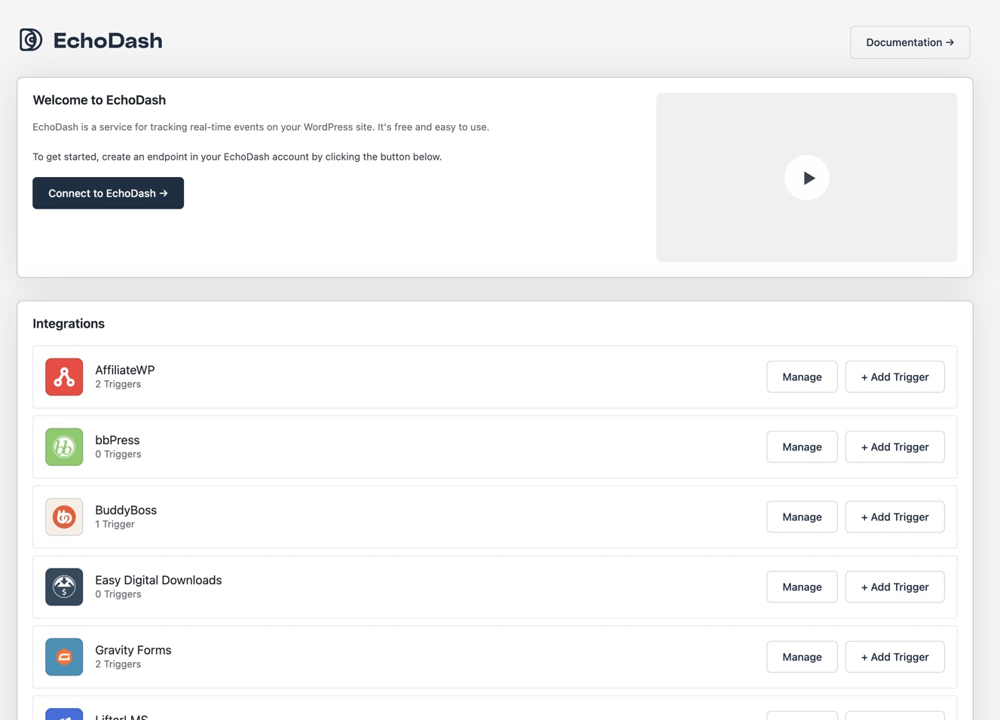
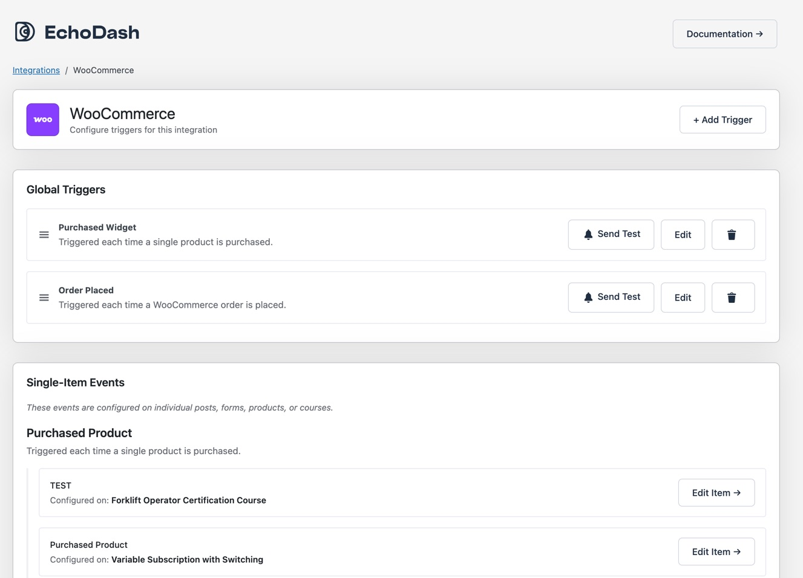
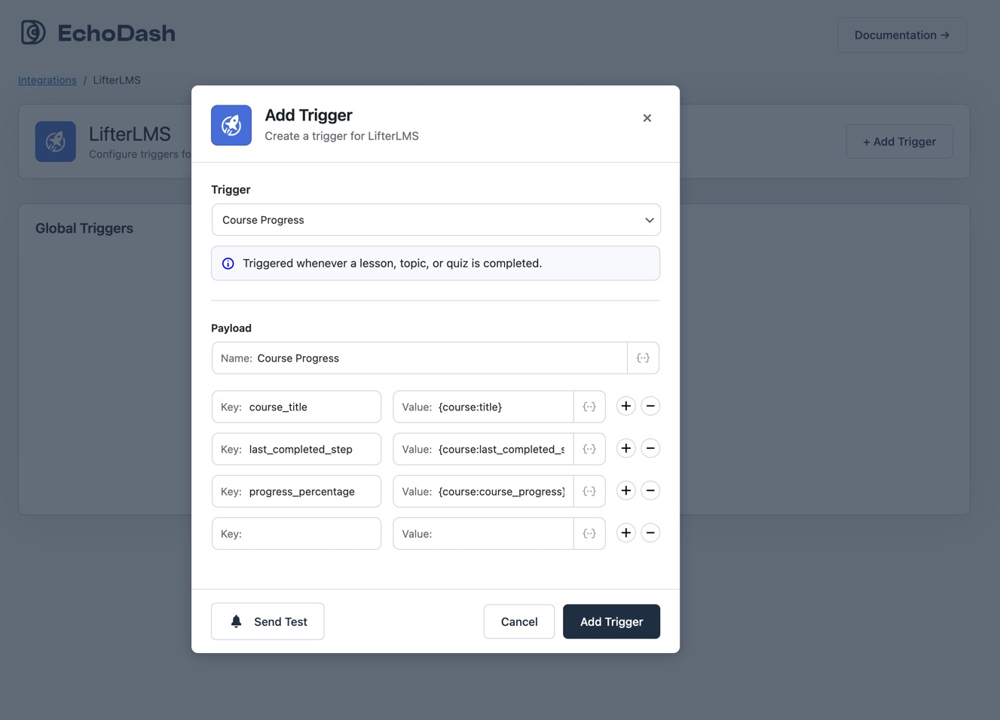
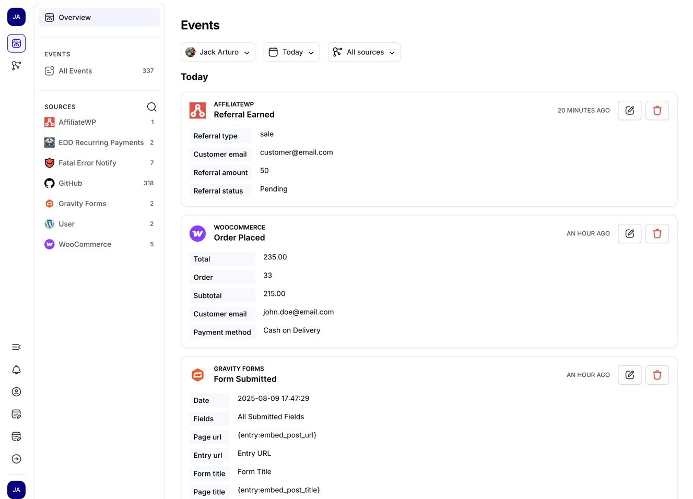

# EchoDash WordPress Plugin

Track user events and interactions across your WordPress site with EchoDash analytics. Built for site owners who need detailed insights into user behavior across multiple WordPress plugins.

## Initial Setup

1. Install and activate the EchoDash plugin from the [WordPress plugin directory](https://wordpress.org/plugins/echodash/)
2. Go to Settings → EchoDash in your WordPress admin
3. Click "Connect to EchoDash" 
4. Create a free EchoDash account or log in
5. Your site will automatically connect and create a webhook endpoint



## Configuring Events

Each supported plugin integration has pre-configured events you can enable and customize:

1. Select an integration (e.g. WooCommerce, Gravity Forms)
2. Click Add Trigger to add a new trigger
3. Select the event you want to track
4. Customize the event name and data fields
5. Click "Add Trigger" to save your changes



### Using Merge Fields

Merge fields let you include dynamic data in your events. Format: `{source:field}`

Common merge field sources:

- `{user:email}` - Current user's email
- `{user:display_name}` - User's display name  
- `{post:title}` - Current post title
- `{post:id}` - Post ID
- `{order:total}` - Order total (WooCommerce)
- `{subscription:status}` - Subscription status

You can click the dropdown in the editor to see a list of available merge fields for the trigger.



Example event data:

```
Event Name: New Order
Customer Email: {user:email}
Order Total: {order:total}
Products: {order:items}
```


## Testing Events

1. Configure an event you want to test
2. Click the "Send Test Event" button
3. The test event will appear in your EchoDash dashboard
4. Verify the data is formatted correctly

## Supported Integrations

- AffiliateWP - Track referrals and affiliate activity
- bbPress - Track forum activity and engagement
- BuddyPress - Follow member interactions
- Easy Digital Downloads - Monitor purchases and downloads
- EDD Recurring - Track subscription payments
- EDD Software Licensing - Monitor license activations
- GamiPress - Track achievements and rewards
- Give - Track donations and donor activity
- Gravity Forms - Track form submissions
- LearnDash - Monitor course progress
- LifterLMS - Follow student progress
- Presto Player - Track video engagement
- WooCommerce - Track orders and customer behavior
- WooCommerce Subscriptions - Monitor subscriptions
- WordPress Core - Track updates to core and plugins
- Users - Track logins



## FAQs

### Does this slow down my site?

No - EchoDash uses non-blocking API calls to send events after the page loads.

### What data is collected?

You control exactly what data is tracked for each event. We never store sensitive data like passwords or payment details.

### Is the data secure?

Yes - all data is transmitted securely via HTTPS to EchoDash's servers.

## Getting Help

- [Documentation](https://echodash.com/docs/intro)
- [Support Portal](https://echodash.com/contact)
- [GitHub Issues](https://github.com/EchoDash/echodash/issues)