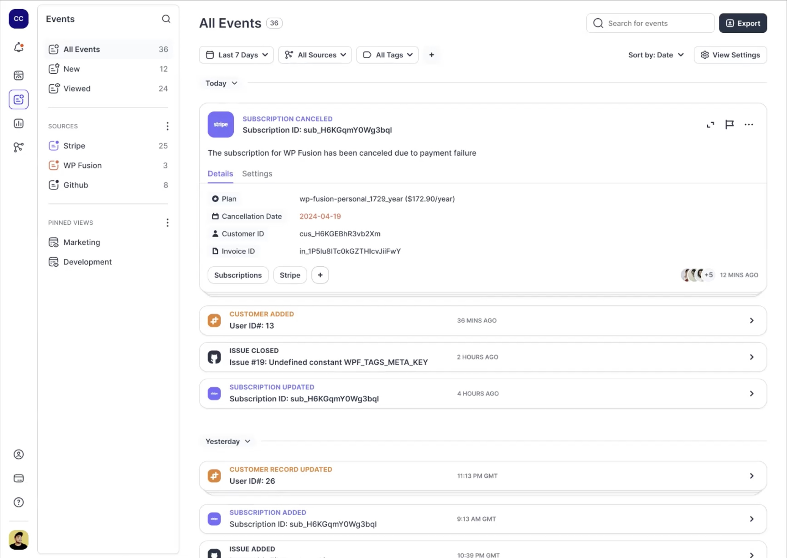

# Introduction to EchoDash

EchoDash is your central notification center for everything you do online. It aggregates all your activity, events, alerts, and notifications from any software you use into a real-time feed, providing actionable insights through AI-powered analysis.

## What is EchoDash?

EchoDash solves notification overload by:
- Consolidating all your notifications in one place
- Using AI to analyze and summarize important data points
- Providing customizable filters and views
- Delivering real-time alerts for what matters most

## Key Features

### 1. Centralized Event Feed
- Real-time updates from all your connected services
- AI-powered summarization of events
- Customizable views and filters

### 2. Smart Notifications
- Cut down on notification noise
- Filter notifications by source or type
- See only the alerts that matter

### 3. Data Security
- We never sell your data
- You control data retention
- Delete your data permanently at any time

### 4. Team Collaboration
- Custom alerts and feeds for each team
- Assign alerts to responsible team members
- Analytics center for data insights

## Getting Started

1. [Create a free account](https://echodash.com/users/sign_up)
2. [Get your webhook URL](https://echodash.com/endpoints)
3. Start sending data using one of our integration methods:
   - [WordPress Plugin](https://wordpress.org/plugins/echodash/)
   - [ConversionBridge](https://conversionbridgewp.com/)
   - [Fatal Error Notify](https://fatalerrornotify.com/)
   - Direct webhook integration
   - Native integrations (coming soon)

## Supported Integrations

EchoDash works with any service that can send webhooks, including:
- Payment processors (Stripe, WooCommerce)
- Form builders (Gravity Forms, Calendly)
- Project management (GitHub, Jira)
- Analytics platforms
- Custom applications

## Early Access Program

EchoDash is currently in early access, and our core event feed feature will remain free forever. Join us to help shape the future of notification management and get early access to new features as they're released.

## Next Steps

- [Learn how to send data](/docs/sending-data)
- [Install the WordPress plugin](/docs/echodash-plugin)
- [Contact us](/contact) for support or feature requests