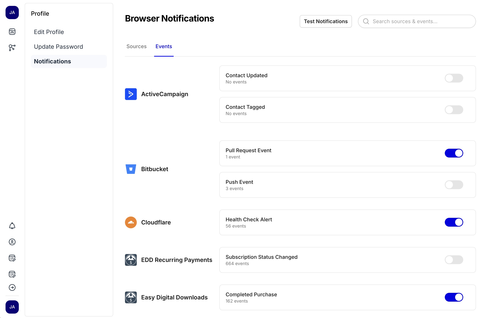

# Using Notifications

EchoDash's notification system allows you to receive real-time browser notifications for events you care about. This feature helps you stay informed about important activities without needing to keep the EchoDash dashboard open at all times.

## Enabling Notifications

To start receiving notifications:

1. Navigate to your profile
2. Click the "Notifications" tab
3. Toggle notifications for specific sources you want to monitor

Your browser will prompt you once to allow notifications from EchoDash. After enabling this permission, desktop notifications will appear as long as you have the EchoDash tab open in your browser.

## Configuring Notification Preferences

### Notifications by Source

The "Notifications" tab displays all available sources of events in your EchoDash account. You can selectively enable or disable notifications for each source by clicking the toggle switch next to it.

This allows you to:
- Focus on high-priority sources
- Reduce notification noise
- Customize your alert experience

### Notifications by Event Type

For more granular control, EchoDash allows you to configure notifications based on specific event types:

1. In the Notifications section, navigate to the "Events" tab
2. Select the specific events you want to receive notifications for
3. Toggle notifications for each event type

## Browser Compatibility

EchoDash notifications work with all major browsers that support the Web Notifications API, including:
- Chrome
- Firefox
- Safari
- Edge

## Troubleshooting

If you're not receiving notifications:

1. Check that you've enabled notifications for at least one source
2. Verify that you've granted browser permission for EchoDash to send notifications
3. Ensure that the EchoDash tab is open in your browser
4. Check your browser settings to confirm notifications are not blocked