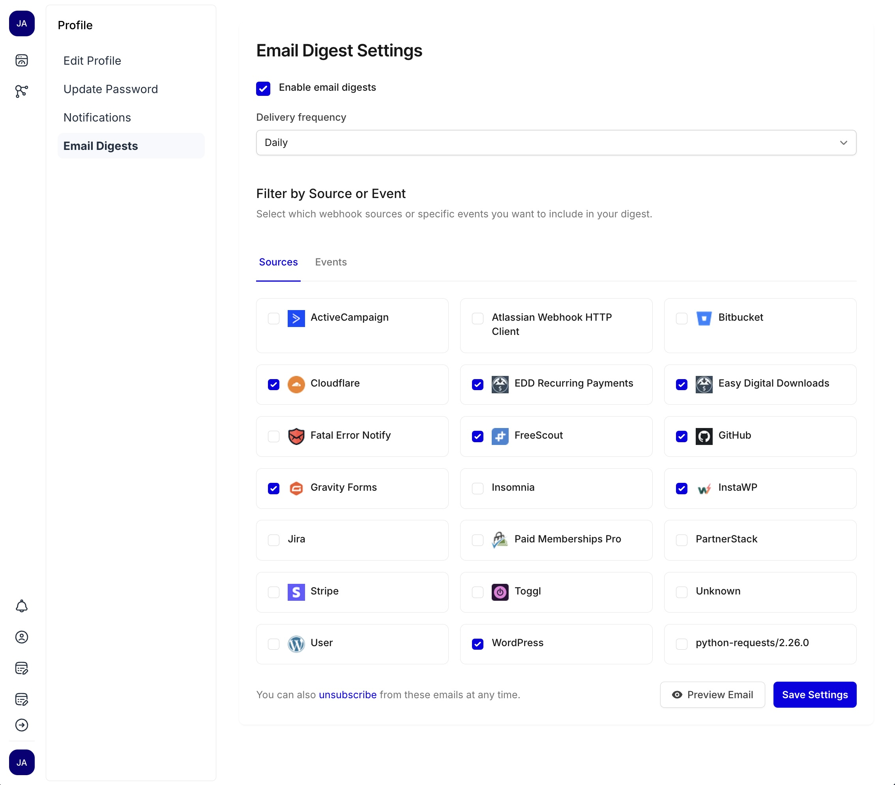
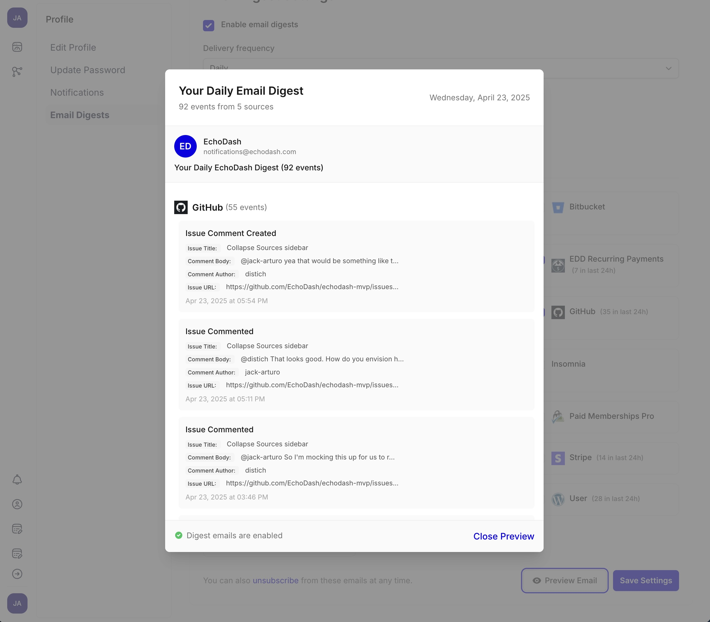

# Email Digests

EchoDash's email digest feature allows you to receive periodic summaries of webhook events via email. This feature helps you stay informed about important activities without needing to constantly check the EchoDash dashboard.

## Enabling Email Digests

To start receiving email digests:

1. Navigate to your profile
2. Click the "Email Digests" tab
3. Check the "Enable email digests" option
4. Select your preferred delivery frequency from the dropdown (Daily, etc.)
5. Click "Save Settings" to apply your changes

## Configuring Email Digest Preferences

### Filter by Source or Event

The email digests settings page allows you to selectively choose which sources and events to include in your digest emails:

1. Navigate to the "Sources" tab to select webhook sources
2. Or switch to the "Events" tab to filter by specific event types
3. Check the boxes next to the sources or events you want to include

This allows you to:
- Focus on high-priority webhooks
- Reduce email noise
- Customize your digest experience

### Preview Your Email Digest

Before finalizing your settings, you can preview how your email digest will appear:

1. Configure your source and event preferences
2. Click the "Preview Email" button to see a sample digest
3. Review the layout and content of your digest

## Digest Content

Each email digest includes:
- A summary header showing the total number of events and sources
- Grouped events by source with their respective counts
- Detailed information for each event including titles, timestamps, and relevant data
- Direct links to the original events

## Managing Your Subscription

You can manage your email digest subscription at any time:

1. Return to the Email Digests settings page to modify your preferences
2. Adjust which sources or events are included
3. Change your delivery frequency
4. Use the "unsubscribe" link in any digest email to opt out completely

If you no longer wish to receive digests, simply uncheck the "Enable email digests" option or click the unsubscribe link in any digest email.
